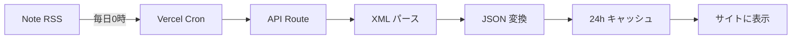

# Note記事の自動更新システム

みかわAI学校サイトでは、Noteの記事を**完全自動**で取得・更新する仕組みを実装しています。

## 🎯 概要

- ✅ **毎日0時（JST）に自動更新**
- ✅ **手動操作は一切不要**
- ✅ **最大50件の記事を自動取得**
- ✅ **24時間キャッシュで高速表示**

---

## 🔄 自動更新の流れ



### 1. **Vercel Cron（スケジューラー）**
```json
// vercel.json
{
  "crons": [
    {
      "path": "/api/note-articles",
      "schedule": "0 0 * * *"  // 毎日0時
    }
  ]
}
```

### 2. **API Route（データ取得）**
```typescript
// src/app/api/note-articles/route.ts
export const revalidate = 86400; // 24時間

export async function GET() {
  // RSSフィードを取得
  const response = await fetch('https://note.com/shimizu_ai_ichi/rss');
  
  // XMLをパース
  const articles = parseRSSFeed(xmlText);
  
  return NextResponse.json({ articles });
}
```

### 3. **ISR（Incremental Static Regeneration）**
- Next.jsの機能で24時間ごとに自動再生成
- ユーザーがページを開いても高速表示
- サーバー負荷を最小限に

---

## 📁 ファイル構成

```
src/
├── app/
│   └── api/
│       └── note-articles/
│           └── route.ts          # API Route（RSS取得・パース）
├── lib/
│   ├── services/
│   │   └── note-rss.ts           # Note記事取得サービス
│   └── types/
│       └── events.ts             # 型定義
└── components/
    └── sections/
        └── NewsSection.tsx       # 表示コンポーネント
vercel.json                       # Vercel Cron設定
```

---

## 🚀 使い方

### 開発環境で確認

```bash
# 開発サーバーを起動
npm run dev

# APIを直接確認
curl http://localhost:3000/api/note-articles
```

### 本番環境で確認

```bash
# デプロイ後、APIを確認
curl https://your-domain.com/api/note-articles
```

---

## ⚙️ カスタマイズ

### 更新頻度を変更

```json
// vercel.json
{
  "crons": [
    {
      "path": "/api/note-articles",
      "schedule": "0 */6 * * *"  // 6時間ごと
    }
  ]
}
```

Cron構文：
- `0 0 * * *` : 毎日0時
- `0 */6 * * *` : 6時間ごと
- `0 0 * * 1` : 毎週月曜日0時

参考：[Cron構文](https://crontab.guru/)

### 取得件数を変更

```typescript
// src/app/api/note-articles/route.ts

// 50件 → 100件に変更
const articles = parseRSSFeed(xmlText, 100);
```

### キャッシュ時間を変更

```typescript
// src/app/api/note-articles/route.ts

// 24時間 → 12時間に変更
export const revalidate = 43200; // 12時間（43200秒）
```

---

## 🛠️ トラブルシューティング

### 記事が更新されない

1. **Vercel Cronの動作確認**
   - Vercel Dashboard > Crons で実行履歴を確認
   - エラーログをチェック

2. **APIの動作確認**
   ```bash
   curl https://your-domain.com/api/note-articles
   ```

3. **RSSフィードの確認**
   - ブラウザで https://note.com/shimizu_ai_ichi/rss を開く
   - XMLが正しく表示されるか確認

### エラーログの確認

```bash
# Vercelの場合
vercel logs your-deployment-url

# ローカルの場合
# サーバーコンソールを確認
```

### 強制的に更新

```bash
# ローカル環境
rm -rf .next
npm run dev

# 本番環境
# Vercelで再デプロイ
vercel --prod
```

---

## 📊 モニタリング

### APIの状態確認

```bash
# レスポンスタイム確認
time curl https://your-domain.com/api/note-articles

# ヘッダー確認（キャッシュ状態）
curl -I https://your-domain.com/api/note-articles
```

### 記事数の確認

```bash
# jqを使った確認
curl https://your-domain.com/api/note-articles | jq '.count'
```

---

## 🔒 セキュリティ

- RSSフィードは公開情報のみ
- API Keyは不要
- Rate Limitingは自動（Vercel）
- CORS設定は不要（内部API）

---

## 📚 参考リンク

- [Next.js API Routes](https://nextjs.org/docs/app/building-your-application/routing/route-handlers)
- [Vercel Cron Jobs](https://vercel.com/docs/cron-jobs)
- [Next.js ISR](https://nextjs.org/docs/app/building-your-application/data-fetching/fetching-caching-and-revalidating#revalidating-data)
- [Note RSS仕様](https://note.com/)

---

**最終更新日**: 2025年10月6日

