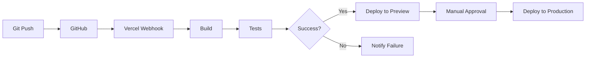

# みかわAI学校 - 技術仕様書

**作成日**: 2025年10月5日  
**バージョン**: 1.0  
**対象**: 開発チーム

---

## 📋 目次

1. [システムアーキテクチャ](#1-システムアーキテクチャ)
2. [技術スタック詳細](#2-技術スタック詳細)
3. [フロントエンド仕様](#3-フロントエンド仕様)
4. [バックエンド仕様](#4-バックエンド仕様)
5. [データベース設計](#5-データベース設計)
6. [API仕様](#6-api仕様)
7. [セキュリティ実装](#7-セキュリティ実装)
8. [デプロイ戦略](#8-デプロイ戦略)
9. [監視・ログ](#9-監視ログ)
10. [パフォーマンス最適化](#10-パフォーマンス最適化)

---

## 1. システムアーキテクチャ

### 1.1 全体構成図

```
┌─────────────────────────────────────────────────────────────┐
│                         ユーザー                              │
└────────────────────┬────────────────────────────────────────┘
                     │
                     │ HTTPS
                     ▼
┌─────────────────────────────────────────────────────────────┐
│                    Vercel (CDN + Edge)                       │
│                                                               │
│  ┌────────────────────────────────────────────────────┐     │
│  │           Next.js 14 (App Router)                  │     │
│  │                                                     │     │
│  │  • SSR/SSG                                         │     │
│  │  • React Server Components                        │     │
│  │  • HeroUI Components                              │     │
│  │  • Tailwind CSS                                   │     │
│  └────────────────────────────────────────────────────┘     │
└─────────────────────┬───────────────────────────────────────┘
                      │
                      │ POST JSON
                      ▼
┌─────────────────────────────────────────────────────────────┐
│              Google Apps Script (Web App)                    │
│                                                               │
│  ┌──────────────────┐  ┌──────────────────┐                │
│  │  doPost Handler  │  │  reCAPTCHA       │                │
│  │                  │─▶│  Verification    │                │
│  └──────────────────┘  └──────────────────┘                │
│           │                                                  │
│           ▼                                                  │
│  ┌──────────────────┐  ┌──────────────────┐                │
│  │  Data Validation │  │  Google Sheets   │                │
│  │                  │─▶│  Write           │                │
│  └──────────────────┘  └──────────────────┘                │
│           │                                                  │
│           ├──────────▶  MailApp (Auto Reply)                │
│           │                                                  │
│           └──────────▶  Slack Webhook (Notification)        │
└─────────────────────────────────────────────────────────────┘
```

### 1.2 データフロー

```
[User Input] 
    ↓
[React Hook Form + Zod Validation]
    ↓
[reCAPTCHA Token Generation]
    ↓
[Next.js API Route (Proxy)]
    ↓
[Google Apps Script]
    ↓
    ├─→ [reCAPTCHA Verify API]
    ├─→ [Google Sheets Insert]
    ├─→ [MailApp Send]
    └─→ [Slack Webhook]
    ↓
[Success/Error Response]
    ↓
[User Feedback (Modal/Toast)]
```

---

## 2. 技術スタック詳細

### 2.1 フロントエンド

| 技術 | バージョン | 用途 |
|------|-----------|------|
| Next.js | 14.2.x | フレームワーク |
| React | 18.3.x | UIライブラリ |
| TypeScript | 5.4.x | 型安全性 |
| HeroUI (NextUI) | 2.x | UIコンポーネント |
| Tailwind CSS | 3.4.x | スタイリング |
| React Hook Form | 7.x | フォーム管理 |
| Zod | 3.x | スキーマバリデーション |
| Framer Motion | 11.x | アニメーション（オプション） |

### 2.2 バックエンド

| 技術 | 用途 |
|------|------|
| Google Apps Script | サーバーレス API |
| Google Sheets API | データストレージ |
| reCAPTCHA v3 | ボット対策 |
| MailApp (GAS) | メール送信 |
| Slack Incoming Webhooks | 通知 |

### 2.3 開発ツール

| ツール | 用途 |
|--------|------|
| Git / GitHub | バージョン管理 |
| VS Code | IDE |
| ESLint | 静的解析 |
| Prettier | コードフォーマット |
| Vercel CLI | デプロイ |

---

## 3. フロントエンド仕様

### 3.1 プロジェクト構成

```
app/
├── layout.tsx                 # ルートレイアウト
├── page.tsx                   # トップページ（LP）
├── operate/
│   └── page.tsx              # 学長紹介ページ
├── privacy/
│   └── page.tsx              # プライバシーポリシー
├── terms/
│   └── page.tsx              # 特定商取引法
├── thanks/
│   └── page.tsx              # 送信完了ページ
└── api/
    └── submit/
        └── route.ts          # フォーム送信APIプロキシ

components/
├── layout/
│   ├── Header.tsx            # ヘッダー
│   ├── Footer.tsx            # フッター
│   └── NoticeBanner.tsx      # お知らせバナー
├── sections/
│   ├── HeroSection.tsx       # ヒーローセクション
│   ├── AboutSection.tsx      # About
│   ├── UsecasesSection.tsx   # 利用例
│   ├── FlowSection.tsx       # 参加の流れ
│   ├── EventsSection.tsx     # イベント一覧
│   ├── RegisterFormSection.tsx # フォームセクション
│   ├── FAQSection.tsx        # FAQ
│   └── PrincipalSection.tsx  # 学長紹介
├── forms/
│   ├── RegisterForm.tsx      # メインフォーム
│   ├── Step1Form.tsx         # ステップ1
│   ├── Step2Form.tsx         # ステップ2
│   └── ConfirmationForm.tsx  # 確認画面
├── ui/
│   ├── Card.tsx              # カード
│   ├── Button.tsx            # ボタン
│   ├── Accordion.tsx         # アコーディオン
│   └── Modal.tsx             # モーダル
└── animations/
    ├── ParticleBackground.tsx # パーティクル背景
    └── ScrollReveal.tsx      # スクロールアニメーション

lib/
├── validations/
│   └── formSchema.ts         # Zodスキーマ定義
├── utils/
│   ├── helpers.ts            # ヘルパー関数
│   └── api.ts                # API呼び出し
└── constants/
    ├── content.ts            # コンテンツ定義
    └── navigation.ts         # ナビゲーション定義

types/
└── index.ts                  # 型定義

styles/
└── globals.css               # グローバルCSS
```

### 3.2 コンポーネント設計

#### 3.2.1 ページコンポーネント（app/page.tsx）

```tsx
// app/page.tsx
import HeroSection from '@/components/sections/HeroSection';
import AboutSection from '@/components/sections/AboutSection';
import UsecasesSection from '@/components/sections/UsecasesSection';
import FlowSection from '@/components/sections/FlowSection';
import EventsSection from '@/components/sections/EventsSection';
import RegisterFormSection from '@/components/sections/RegisterFormSection';
import FAQSection from '@/components/sections/FAQSection';
import PrincipalSection from '@/components/sections/PrincipalSection';

export default function HomePage() {
  return (
    <main>
      <HeroSection />
      <AboutSection />
      <UsecasesSection />
      <FlowSection />
      <EventsSection />
      <RegisterFormSection />
      <FAQSection />
      <PrincipalSection />
    </main>
  );
}
```

#### 3.2.2 フォームコンポーネント

```tsx
// components/forms/RegisterForm.tsx
'use client';

import { useState } from 'react';
import { useForm } from 'react-hook-form';
import { zodResolver } from '@hookform/resolvers/zod';
import { formSchema, type FormData } from '@/lib/validations/formSchema';
import Step1Form from './Step1Form';
import Step2Form from './Step2Form';
import ConfirmationForm from './ConfirmationForm';

export default function RegisterForm() {
  const [step, setStep] = useState(1);
  const form = useForm<FormData>({
    resolver: zodResolver(formSchema),
    mode: 'onBlur',
  });

  const onSubmit = async (data: FormData) => {
    // API呼び出し処理
  };

  return (
    <form onSubmit={form.handleSubmit(onSubmit)}>
      {step === 1 && <Step1Form form={form} onNext={() => setStep(2)} />}
      {step === 2 && <Step2Form form={form} onNext={() => setStep(3)} onBack={() => setStep(1)} />}
      {step === 3 && <ConfirmationForm form={form} onBack={() => setStep(2)} />}
    </form>
  );
}
```

### 3.3 型定義

```typescript
// types/index.ts

export type ApplicationType = 'invite' | 'seminar';

export type UserRole = 
  | 'business_owner'
  | 'employee'
  | 'homemaker'
  | 'unemployed'
  | 'student'
  | 'other';

export interface FormData {
  // Step 1
  name: string;
  email: string;
  phone?: string;
  application_type: ApplicationType;
  role: UserRole;
  consent_privacy: boolean;
  
  // Step 2 (conditional)
  participants_count?: number;
  venue_type?: string;
  event_selected?: string;
  preferred_area?: string;
  notes?: string;
  
  // Meta
  recaptchaToken: string;
  token: string;
}

export interface SubmitResponse {
  status: 'ok' | 'error';
  message?: string;
}

export interface Event {
  id: string;
  title: string;
  date: string;
  time: string;
  venue: string;
  description: string;
  capacity: number;
  price: string;
}
```

### 3.4 バリデーションスキーマ

```typescript
// lib/validations/formSchema.ts
import { z } from 'zod';

export const formSchema = z.object({
  name: z.string()
    .min(1, 'お名前を入力してください')
    .max(100, 'お名前は100文字以内で入力してください'),
  
  email: z.string()
    .min(1, 'メールアドレスを入力してください')
    .email('有効なメールアドレスを入力してください'),
  
  phone: z.string().optional(),
  
  application_type: z.enum(['invite', 'seminar'], {
    required_error: '参加の種類を選択してください',
  }),
  
  role: z.enum([
    'business_owner',
    'employee',
    'homemaker',
    'unemployed',
    'student',
    'other'
  ], {
    required_error: '属性を選択してください',
  }),
  
  participants_count: z.number()
    .int()
    .min(1, '予定人数は1以上で入力してください')
    .optional(),
  
  venue_type: z.string().max(200).optional(),
  
  event_selected: z.string().max(200).optional(),
  
  preferred_area: z.string().max(100).optional(),
  
  notes: z.string().max(1000).optional(),
  
  consent_privacy: z.boolean()
    .refine((val) => val === true, {
      message: 'プライバシーポリシーへの同意が必要です',
    }),
  
  recaptchaToken: z.string(),
  
  token: z.string(),
}).refine((data) => {
  // 招集型の場合、participants_countは必須
  if (data.application_type === 'invite') {
    return data.participants_count !== undefined && data.participants_count > 0;
  }
  return true;
}, {
  message: '招集型を選択した場合、予定人数の入力が必須です',
  path: ['participants_count'],
});

export type FormData = z.infer<typeof formSchema>;
```

### 3.5 コンテンツ定義

```typescript
// lib/constants/content.ts

export const HERO_CONTENT = {
  title: '仕事にも暮らしにも効くAI',
  subtitle: '三河の現場で本当に役立つAIの使い方を学ぶ。経営者・会社員・地域のみんなが同じスタートで使える実践スクール。',
  ctaPrimary: '優先登録する',
  ctaSecondary: '次回イベントを見る',
};

export const ABOUT_CONTENT = {
  short: 'みかわAI学校は、三河地域から「実務で使えるAI」を広げる実践スクールです。経営者・会社員・主婦・シニア・子どもまで、誰でも同じスタートで学べる場を目指します。まずは優先登録で案内を受け取ってください。',
  mission: 'みかわAI学校は、誰もが等しくAIを学び、自分の価値を高められる地域の学び場を作ります。',
  vision: '地域のすべての人が"使えるAI"を手にし、仕事や暮らしで実利を生む。学びの入口を平等にし、地域のDXを底上げすることを目指します。',
  concept: '現場で、すぐ使える。小さなグループで手を動かす。三河発の実践AIスクール。',
};

export const USECASES = [
  {
    id: 1,
    title: '業務効率化',
    description: '日々の手作業をAIで自動化・短縮。',
    examples: '請求書の要約、メール定型文作成、日報の自動生成。',
    link: '#register-form',
  },
  {
    id: 2,
    title: '営業・顧客対応',
    description: '顧客対応の品質向上と営業資料作成の時間短縮。',
    examples: '問い合わせ要約、提案書テンプレ作成、顧客属性別応答例。',
    link: '#register-form',
  },
  {
    id: 3,
    title: '現場作業支援（製造）',
    description: '現場の作業指示書や点検報告のデジタル化。',
    examples: '点検記録の要約・検索、作業手順書の自動生成。',
    link: '#register-form',
  },
  {
    id: 4,
    title: '暮らしの便利ツール',
    description: '日常生活で使えるAI活用法。',
    examples: '家計管理テンプレ、学習支援、趣味の情報収集を効率化。',
    link: '#register-form',
  },
  {
    id: 5,
    title: '子ども向け体験',
    description: '未来の学びにつながる楽しい導入ワークショップ。',
    examples: 'AIで絵を作る・簡単なプログラム体験・問題解決ワーク。',
    link: '#register-form',
  },
  {
    id: 6,
    title: '導入相談（企業向け）',
    description: '現状把握から導入計画まで伴走支援。',
    examples: '無料AI診断→導入ロードマップ作成→試験導入支援。',
    link: '#register-form',
  },
];

export const FAQ_ITEMS = [
  {
    id: 1,
    question: '招集型とは何ですか?',
    answer: '代表者が人数（3〜5名）を集めて実施する少人数ハンズオンです。運営は開催キット（招待文／進行表／配布資料）を提供します。',
  },
  {
    id: 2,
    question: '公開セミナーへの参加はどうすれば良いですか?',
    answer: 'イベント一覧ページから該当イベントに直接申し込むか、当サイトの「公開セミナー待機」フォームで優先案内を受け取ってください。',
  },
  {
    id: 3,
    question: '参加費はかかりますか?',
    answer: '基本的に無料のイベントが中心です。特別プログラムは有料のことがあります（イベント詳細参照）。',
  },
  {
    id: 4,
    question: '子どもも参加できますか?',
    answer: '子ども向けワークショップを別途開催します。保護者同伴が必要な回もありますのでイベント詳細をご確認ください。',
  },
  {
    id: 5,
    question: '録画や資料は配布されますか?',
    answer: '原則として配布しますが、録画・公開は参加者の同意を得て行います。',
  },
  {
    id: 6,
    question: '紹介者がいると優先になりますか?',
    answer: '紹介者がいると優先案内の対象になります（確認措置を行う場合があります）。',
  },
  {
    id: 7,
    question: 'フォームに記入した情報はどのように扱われますか?',
    answer: 'フォーム情報は当校の管理用スプレッドシートに保管し、イベント運営・連絡以外の目的では使用しません。プライバシーポリシーに従います。',
  },
  {
    id: 8,
    question: '問い合わせ先は?',
    answer: 'info@example.jp にご連絡ください。',
  },
];
```

### 3.6 Tailwind設定

```javascript
// tailwind.config.ts
import type { Config } from 'tailwindcss';
import { nextui } from '@nextui-org/react';

const config: Config = {
  content: [
    './pages/**/*.{js,ts,jsx,tsx,mdx}',
    './components/**/*.{js,ts,jsx,tsx,mdx}',
    './app/**/*.{js,ts,jsx,tsx,mdx}',
    './node_modules/@nextui-org/theme/dist/**/*.{js,ts,jsx,tsx}',
  ],
  theme: {
    extend: {
      colors: {
        primary: {
          DEFAULT: '#2C5F8D',
          dark: '#1E4D7A',
        },
        secondary: {
          DEFAULT: '#56B7C7',
        },
        accent: {
          DEFAULT: '#F47E20',
        },
      },
      fontFamily: {
        sans: ['Noto Sans JP', 'sans-serif'],
      },
      spacing: {
        xs: '8px',
        sm: '12px',
        md: '16px',
        lg: '24px',
        xl: '32px',
        '2xl': '48px',
        '3xl': '64px',
        '4xl': '80px',
      },
    },
  },
  darkMode: 'class',
  plugins: [nextui()],
};

export default config;
```

---

## 4. バックエンド仕様

### 4.1 Google Apps Script 構成

```
gas/
├── Code.gs           # メインハンドラー
├── Config.gs         # 設定
├── Validation.gs     # バリデーション
├── Sheet.gs          # スプレッドシート操作
├── Mail.gs           # メール送信
├── Slack.gs          # Slack通知
└── Recaptcha.gs      # reCAPTCHA検証
```

### 4.2 Code.gs（メインハンドラー）

```javascript
// gas/Code.gs

function doPost(e) {
  try {
    // リクエストボディを取得
    const requestBody = e.postData.contents;
    const data = JSON.parse(requestBody);
    
    // ログ記録
    Logger.log('Received data: ' + JSON.stringify(data));
    
    // バリデーション
    const validationResult = validateFormData(data);
    if (!validationResult.isValid) {
      return createErrorResponse(validationResult.message);
    }
    
    // reCAPTCHA検証
    const recaptchaResult = verifyRecaptcha(data.recaptchaToken);
    if (!recaptchaResult.success) {
      return createErrorResponse('reCAPTCHA検証に失敗しました');
    }
    
    // スコアチェック（0.5以上を合格とする）
    if (recaptchaResult.score < 0.5) {
      Logger.log('Low reCAPTCHA score: ' + recaptchaResult.score);
      return createErrorResponse('不正なアクセスの可能性があります');
    }
    
    // スプレッドシートに書き込み
    const rowNumber = writeToSheet(data);
    
    // 自動返信メール送信
    sendAutoReplyEmail(data);
    
    // Slack通知
    sendSlackNotification(data, rowNumber);
    
    // 成功レスポンス
    return createSuccessResponse();
    
  } catch (error) {
    Logger.log('Error: ' + error.toString());
    
    // エラー通知（管理者へ）
    sendErrorNotification(error, e);
    
    return createErrorResponse('送信処理中にエラーが発生しました');
  }
}

function createSuccessResponse() {
  return ContentService
    .createTextOutput(JSON.stringify({ status: 'ok' }))
    .setMimeType(ContentService.MimeType.JSON);
}

function createErrorResponse(message) {
  return ContentService
    .createTextOutput(JSON.stringify({ 
      status: 'error', 
      message: message 
    }))
    .setMimeType(ContentService.MimeType.JSON);
}
```

### 4.3 Config.gs（設定）

```javascript
// gas/Config.gs

const CONFIG = {
  // スプレッドシート
  SPREADSHEET_ID: 'YOUR_SPREADSHEET_ID',
  SHEET_NAME: 'registrations',
  
  // reCAPTCHA
  RECAPTCHA_SECRET_KEY: 'YOUR_RECAPTCHA_SECRET_KEY',
  RECAPTCHA_VERIFY_URL: 'https://www.google.com/recaptcha/api/siteverify',
  RECAPTCHA_THRESHOLD: 0.5,
  
  // Slack
  SLACK_WEBHOOK_URL: 'YOUR_SLACK_WEBHOOK_URL',
  
  // メール
  REPLY_EMAIL: 'info@example.jp',
  REPLY_NAME: 'みかわAI学校',
  
  // その他
  TIMEZONE: 'Asia/Tokyo',
};

function getConfig() {
  return CONFIG;
}
```

### 4.4 Validation.gs（バリデーション）

```javascript
// gas/Validation.gs

function validateFormData(data) {
  const errors = [];
  
  // 必須項目チェック
  if (!data.name || data.name.trim() === '') {
    errors.push('お名前は必須です');
  }
  
  if (!data.email || data.email.trim() === '') {
    errors.push('メールアドレスは必須です');
  } else if (!isValidEmail(data.email)) {
    errors.push('メールアドレスの形式が正しくありません');
  }
  
  if (!data.application_type) {
    errors.push('参加の種類は必須です');
  }
  
  if (!data.role) {
    errors.push('属性は必須です');
  }
  
  if (data.consent_privacy !== true) {
    errors.push('プライバシーポリシーへの同意が必要です');
  }
  
  // 招集型の場合、participants_countは必須
  if (data.application_type === 'invite') {
    if (!data.participants_count || data.participants_count < 1) {
      errors.push('招集型の場合、予定人数は必須です（1以上）');
    }
  }
  
  if (errors.length > 0) {
    return {
      isValid: false,
      message: errors.join(', ')
    };
  }
  
  return { isValid: true };
}

function isValidEmail(email) {
  const emailRegex = /^[^\s@]+@[^\s@]+\.[^\s@]+$/;
  return emailRegex.test(email);
}
```

### 4.5 Sheet.gs（スプレッドシート操作）

```javascript
// gas/Sheet.gs

function writeToSheet(data) {
  const config = getConfig();
  const ss = SpreadsheetApp.openById(config.SPREADSHEET_ID);
  let sheet = ss.getSheetByName(config.SHEET_NAME);
  
  // シートが存在しない場合は作成
  if (!sheet) {
    sheet = ss.insertSheet(config.SHEET_NAME);
    createSheetHeaders(sheet);
  }
  
  // ヘッダーがない場合は作成
  if (sheet.getLastRow() === 0) {
    createSheetHeaders(sheet);
  }
  
  // データ行を作成
  const timestamp = new Date();
  const row = [
    timestamp,
    data.token || '',
    data.name || '',
    data.email || '',
    data.phone || '',
    data.application_type || '',
    data.role || '',
    data.participants_count || '',
    data.venue_type || '',
    data.event_selected || '',
    data.preferred_area || '',
    data.notes || '',
    data.consent_privacy || false,
    'new', // status
    '', // priority_flag
    '' // admin_notes
  ];
  
  // 行を追加
  sheet.appendRow(row);
  
  // 行番号を返す
  return sheet.getLastRow();
}

function createSheetHeaders(sheet) {
  const headers = [
    'timestamp',
    'token',
    'name',
    'email',
    'phone',
    'application_type',
    'role',
    'participants_count',
    'venue_type',
    'event_selected',
    'preferred_area',
    'notes',
    'consent_privacy',
    'status',
    'priority_flag',
    'admin_notes'
  ];
  
  sheet.appendRow(headers);
  
  // ヘッダー行のスタイル設定
  const headerRange = sheet.getRange(1, 1, 1, headers.length);
  headerRange.setFontWeight('bold');
  headerRange.setBackground('#2C5F8D');
  headerRange.setFontColor('#FFFFFF');
}
```

### 4.6 Mail.gs（メール送信）

```javascript
// gas/Mail.gs

function sendAutoReplyEmail(data) {
  const config = getConfig();
  const subject = 'みかわAI学校：登録ありがとうございます（受付完了）';
  
  const textBody = createTextEmailBody(data);
  const htmlBody = createHtmlEmailBody(data);
  
  MailApp.sendEmail({
    to: data.email,
    subject: subject,
    body: textBody,
    htmlBody: htmlBody,
    name: config.REPLY_NAME,
    replyTo: config.REPLY_EMAIL
  });
  
  Logger.log('Auto-reply email sent to: ' + data.email);
}

function createTextEmailBody(data) {
  return `
${data.name} 様

このたびは、みかわAI学校にご登録いただきありがとうございます。
以下の内容で申込みを受け付けました。運営で内容を確認の上、3営業日以内にご連絡いたします。

【申込内容（サマリ）】
- 代表者名： ${data.name}
- メール： ${data.email}
- 参加の種類： ${data.application_type === 'invite' ? '招集型' : '公開セミナー待機'}
- 属性： ${getRoleLabel(data.role)}
- 集められる予定人数： ${data.participants_count || '未記入'}
- 会場予定： ${data.venue_type || '未記入'}
- 参加希望イベント： ${data.event_selected || '未指定'}
- 参加希望エリア： ${data.preferred_area || '未記入'}
- 備考： ${data.notes || '未記入'}

※ 内容に誤りがある場合は、このメールに返信してください。
次の流れ：運営にて確認し、3営業日以内に「承認の可否」または「案内」をお送りします。

お問い合わせ： info@example.jp

みかわAI学校
合同会社ICHI.
  `.trim();
}

function createHtmlEmailBody(data) {
  return `
<!DOCTYPE html>
<html>
<head>
  <meta charset="utf-8">
  <style>
    body { font-family: sans-serif; line-height: 1.6; color: #333; }
    .container { max-width: 600px; margin: 0 auto; padding: 20px; }
    h1 { color: #2C5F8D; }
    table { width: 100%; border-collapse: collapse; margin: 20px 0; }
    th, td { padding: 10px; text-align: left; border-bottom: 1px solid #ddd; }
    th { background-color: #f5f5f5; font-weight: bold; }
    .footer { margin-top: 30px; padding-top: 20px; border-top: 2px solid #2C5F8D; font-size: 14px; color: #666; }
  </style>
</head>
<body>
  <div class="container">
    <h1>みかわAI学校：登録ありがとうございます</h1>
    
    <p>${data.name} 様</p>
    
    <p>このたびは、みかわAI学校にご登録いただきありがとうございます。<br>
    以下の内容で申込みを受け付けました。運営で内容を確認の上、3営業日以内にご連絡いたします。</p>
    
    <h2>申込内容（サマリ）</h2>
    <table>
      <tr><th>代表者名</th><td>${data.name}</td></tr>
      <tr><th>メール</th><td>${data.email}</td></tr>
      <tr><th>参加の種類</th><td>${data.application_type === 'invite' ? '招集型' : '公開セミナー待機'}</td></tr>
      <tr><th>属性</th><td>${getRoleLabel(data.role)}</td></tr>
      <tr><th>集められる予定人数</th><td>${data.participants_count || '未記入'}</td></tr>
      <tr><th>会場予定</th><td>${data.venue_type || '未記入'}</td></tr>
      <tr><th>参加希望イベント</th><td>${data.event_selected || '未指定'}</td></tr>
      <tr><th>参加希望エリア</th><td>${data.preferred_area || '未記入'}</td></tr>
      <tr><th>備考</th><td>${data.notes || '未記入'}</td></tr>
    </table>
    
    <p><strong>※ 内容に誤りがある場合は、このメールに返信してください。</strong></p>
    
    <p><strong>次の流れ：</strong>運営にて確認し、3営業日以内に「承認の可否」または「案内」をお送りします。</p>
    
    <div class="footer">
      <p><strong>お問い合わせ</strong><br>
      info@example.jp</p>
      
      <p><strong>みかわAI学校</strong><br>
      合同会社ICHI.</p>
    </div>
  </div>
</body>
</html>
  `.trim();
}

function getRoleLabel(role) {
  const roleMap = {
    'business_owner': '経営者',
    'employee': '会社員',
    'homemaker': '主婦・主夫',
    'unemployed': '求職中・無職',
    'student': '学生',
    'other': 'その他'
  };
  return roleMap[role] || role;
}
```

### 4.7 Slack.gs（Slack通知）

```javascript
// gas/Slack.gs

function sendSlackNotification(data, rowNumber) {
  const config = getConfig();
  
  if (!config.SLACK_WEBHOOK_URL) {
    Logger.log('Slack webhook URL not configured');
    return;
  }
  
  const message = {
    text: '新規登録がありました',
    blocks: [
      {
        type: 'header',
        text: {
          type: 'plain_text',
          text: '🎉 新規登録',
          emoji: true
        }
      },
      {
        type: 'section',
        fields: [
          { type: 'mrkdwn', text: `*Name:*\n${data.name}` },
          { type: 'mrkdwn', text: `*Email:*\n${data.email}` },
          { type: 'mrkdwn', text: `*Type:*\n${data.application_type === 'invite' ? '招集型' : '公開セミナー待機'}` },
          { type: 'mrkdwn', text: `*Role:*\n${getRoleLabel(data.role)}` },
          { type: 'mrkdwn', text: `*Row:*\n${rowNumber}` }
        ]
      }
    ]
  };
  
  const options = {
    method: 'post',
    contentType: 'application/json',
    payload: JSON.stringify(message)
  };
  
  try {
    UrlFetchApp.fetch(config.SLACK_WEBHOOK_URL, options);
    Logger.log('Slack notification sent');
  } catch (error) {
    Logger.log('Failed to send Slack notification: ' + error.toString());
  }
}

function sendErrorNotification(error, requestData) {
  const config = getConfig();
  
  if (!config.SLACK_WEBHOOK_URL) {
    return;
  }
  
  const message = {
    text: 'フォーム送信エラー',
    blocks: [
      {
        type: 'header',
        text: {
          type: 'plain_text',
          text: '⚠️ フォーム送信エラー',
          emoji: true
        }
      },
      {
        type: 'section',
        text: {
          type: 'mrkdwn',
          text: `*Error:*\n${error.toString()}\n\n*Time:*\n${new Date().toLocaleString('ja-JP', { timeZone: config.TIMEZONE })}`
        }
      }
    ]
  };
  
  const options = {
    method: 'post',
    contentType: 'application/json',
    payload: JSON.stringify(message)
  };
  
  try {
    UrlFetchApp.fetch(config.SLACK_WEBHOOK_URL, options);
  } catch (err) {
    Logger.log('Failed to send error notification: ' + err.toString());
  }
}
```

### 4.8 Recaptcha.gs（reCAPTCHA検証）

```javascript
// gas/Recaptcha.gs

function verifyRecaptcha(token) {
  const config = getConfig();
  
  if (!token) {
    return {
      success: false,
      score: 0,
      message: 'reCAPTCHA token is missing'
    };
  }
  
  const url = config.RECAPTCHA_VERIFY_URL;
  const payload = {
    secret: config.RECAPTCHA_SECRET_KEY,
    response: token
  };
  
  const options = {
    method: 'post',
    payload: payload
  };
  
  try {
    const response = UrlFetchApp.fetch(url, options);
    const result = JSON.parse(response.getContentText());
    
    Logger.log('reCAPTCHA result: ' + JSON.stringify(result));
    
    return {
      success: result.success,
      score: result.score || 0,
      action: result.action
    };
  } catch (error) {
    Logger.log('reCAPTCHA verification error: ' + error.toString());
    return {
      success: false,
      score: 0,
      message: error.toString()
    };
  }
}
```

---

## 5. データベース設計

### 5.1 Google スプレッドシート構造

#### シート名: `registrations`

| 列 | フィールド名 | データ型 | 説明 | 必須 |
|----|------------|---------|------|------|
| A | timestamp | Date | 登録日時 | ○ |
| B | token | String | セッショントークン | ○ |
| C | name | String | 代表者名 | ○ |
| D | email | String | メールアドレス | ○ |
| E | phone | String | 電話番号 | - |
| F | application_type | String | 参加種類（invite/seminar） | ○ |
| G | role | String | 属性 | ○ |
| H | participants_count | Number | 予定人数 | * |
| I | venue_type | String | 会場予定 | - |
| J | event_selected | String | 参加希望イベント | - |
| K | preferred_area | String | 参加希望エリア | - |
| L | notes | Text | 備考 | - |
| M | consent_privacy | Boolean | プライバシー同意 | ○ |
| N | status | String | ステータス | ○ |
| O | priority_flag | String | 優先度フラグ | - |
| P | admin_notes | Text | 管理者メモ | - |

**\*** 招集型（invite）の場合のみ必須

### 5.2 status フィールドの値

| 値 | 説明 |
|----|------|
| new | 新規登録 |
| reviewed | 確認済み |
| confirmed | 承認済み |
| waitlist | 待機リスト |
| attended | 参加完了 |
| cancelled | キャンセル |

---

## 6. API仕様

### 6.1 フォーム送信API

#### エンドポイント
```
POST /api/submit
```

#### リクエスト

**Headers:**
```
Content-Type: application/json
```

**Body:**
```json
{
  "name": "山田太郎",
  "email": "taro@example.jp",
  "phone": "090-1234-5678",
  "application_type": "invite",
  "role": "business_owner",
  "participants_count": 5,
  "venue_type": "自社会議室",
  "event_selected": "",
  "preferred_area": "",
  "notes": "平日午前希望",
  "consent_privacy": true,
  "recaptchaToken": "03AGdBq...",
  "token": "session_abc123"
}
```

#### レスポンス

**成功時（200 OK）:**
```json
{
  "status": "ok"
}
```

**エラー時（400 Bad Request）:**
```json
{
  "status": "error",
  "message": "メールアドレスの形式が正しくありません"
}
```

---

## 7. セキュリティ実装

### 7.1 reCAPTCHA v3 実装

#### フロントエンド

```tsx
// components/forms/RegisterForm.tsx
'use client';

import { useReCaptcha } from '@/hooks/useReCaptcha';

export default function RegisterForm() {
  const { executeRecaptcha } = useReCaptcha();
  
  const onSubmit = async (data: FormData) => {
    try {
      // reCAPTCHAトークン取得
      const recaptchaToken = await executeRecaptcha('submit');
      
      // APIへ送信
      const response = await fetch('/api/submit', {
        method: 'POST',
        headers: { 'Content-Type': 'application/json' },
        body: JSON.stringify({
          ...data,
          recaptchaToken,
        }),
      });
      
      // レスポンス処理
      const result = await response.json();
      if (result.status === 'ok') {
        // 成功処理
      } else {
        // エラー処理
      }
    } catch (error) {
      // エラーハンドリング
    }
  };
  
  return (/* フォームUI */);
}
```

#### reCAPTCHAフック

```typescript
// hooks/useReCaptcha.ts
'use client';

import { useCallback } from 'react';

declare global {
  interface Window {
    grecaptcha: any;
  }
}

export function useReCaptcha() {
  const executeRecaptcha = useCallback(async (action: string): Promise<string> => {
    return new Promise((resolve, reject) => {
      if (!window.grecaptcha) {
        reject(new Error('reCAPTCHA not loaded'));
        return;
      }
      
      window.grecaptcha.ready(() => {
        window.grecaptcha
          .execute(process.env.NEXT_PUBLIC_RECAPTCHA_SITE_KEY, { action })
          .then(resolve)
          .catch(reject);
      });
    });
  }, []);
  
  return { executeRecaptcha };
}
```

### 7.2 CSRF対策

```typescript
// lib/utils/csrf.ts
import { v4 as uuidv4 } from 'uuid';

export function generateToken(): string {
  return uuidv4();
}

export function storeToken(token: string): void {
  if (typeof window !== 'undefined') {
    sessionStorage.setItem('csrf_token', token);
  }
}

export function getToken(): string | null {
  if (typeof window !== 'undefined') {
    return sessionStorage.getItem('csrf_token');
  }
  return null;
}
```

---

## 8. デプロイ戦略

### 8.1 Vercel デプロイ設定

#### vercel.json

```json
{
  "buildCommand": "npm run build",
  "devCommand": "npm run dev",
  "installCommand": "npm install",
  "framework": "nextjs",
  "outputDirectory": ".next",
  "regions": ["hnd1"],
  "env": {
    "NEXT_PUBLIC_SITE_URL": "@site-url",
    "NEXT_PUBLIC_RECAPTCHA_SITE_KEY": "@recaptcha-site-key",
    "NEXT_PUBLIC_GAS_WEB_APP_URL": "@gas-web-app-url"
  }
}
```

### 8.2 デプロイフロー



### 8.3 環境

| 環境 | ブランチ | URL | 用途 |
|------|---------|-----|------|
| Development | develop | dev.example.com | 開発環境 |
| Staging | staging | staging.example.com | テスト環境 |
| Production | main | www.example.com | 本番環境 |

---

## 9. 監視・ログ

### 9.1 ログ収集

- **フロントエンド**: Vercel Analytics
- **バックエンド**: Google Apps Script ログ
- **エラー追跡**: Sentry（オプション）

### 9.2 監視項目

- ページ読み込み時間
- API レスポンス時間
- エラー率
- フォーム送信成功率
- ユーザー数

---

## 10. パフォーマンス最適化

### 10.1 画像最適化

- WebP形式使用
- Next.js Image コンポーネント使用
- Lazy loading

### 10.2 コード分割

- Dynamic import
- React.lazy
- ルートベース分割

### 10.3 キャッシュ戦略

- Static Generation（SSG）
- Incremental Static Regeneration（ISR）
- CDN キャッシュ

---

**改訂履歴**
- v1.0 (2025-10-05): 初版作成

